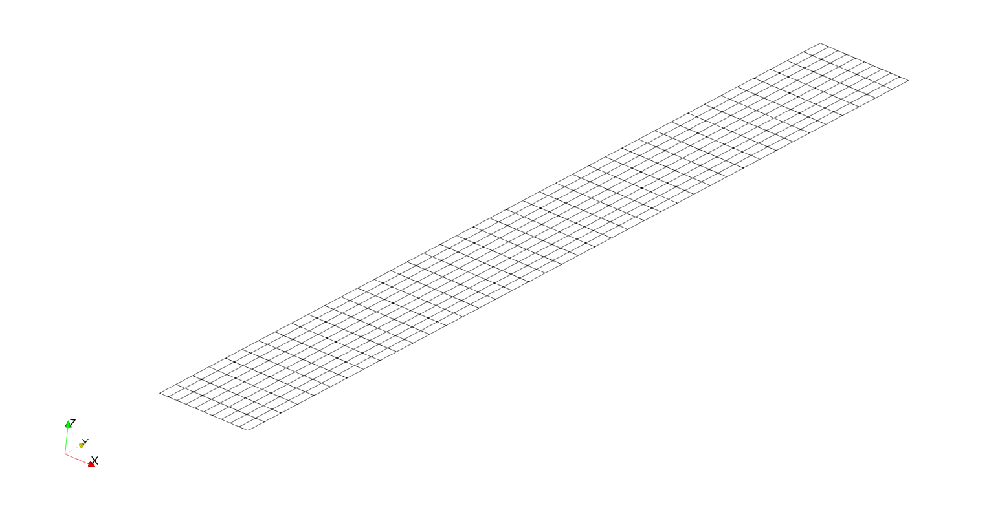
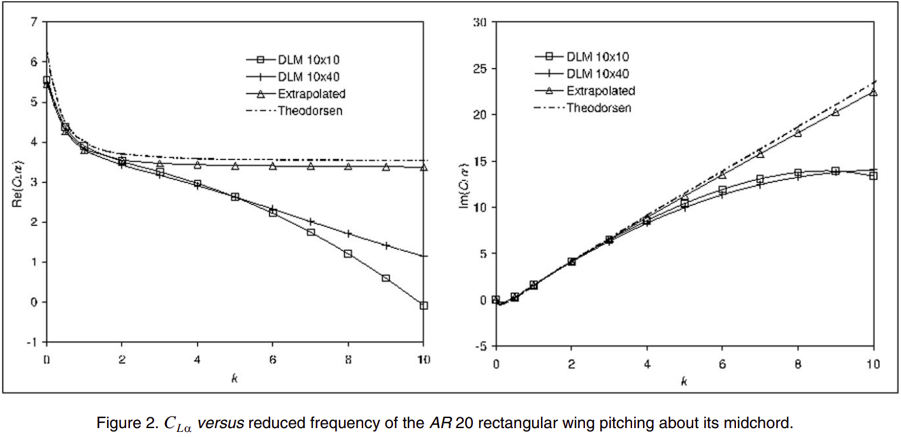

# [Example](@id Example)

This example shows how to use DLM.jl to solve for the lift coefficient slope of a rectangular wing with an aspect ratio of 20 pitching about its midchord.

```@contents
Pages = ["example.md"]
Depth = 3
```

```@example example
using DLM
```

## Defining the geometry

Surfaces are defined in DLM.jl by creating rectangular grids with shape `(3, ni, nj)`.  The first dimension is used for the x, y, and z coordinates, respectively.  The second dimension is used for the grid index in the chordwise direction.  The third dimension is used for the grid index in the spanwise direction.

Here we will create the AR 20 wing with 10 panels in the chordwise direction and 40 panels in the spanwise direction.
```@example example
  AR = 20

  nchord = 10
  nspan = 40

  b = 10
  semispan = b/2
  chord = b/AR
  symmetric = true

  xyz = zeros(3, nchord+1, nspan+1)
  for i = 1:nchord+1
      for j = 1:nspan+1
          xyz[1, i, j] = chord*(i-1)/nchord
          xyz[2, i, j] = semispan*(j-1)/nspan
      end
  end
  nothing #hide
```

Using this convention, the geometry can be easily visualized using [WriteVTK](https://github.com/jipolanco/WriteVTK.jl).

```@example example
using WriteVTK

# add extra dimension for WriteVTK
xyz_vtk = reshape(xyz, size(xyz)..., 1)

# initialize vtk file
vtkfile = vtk_grid("example", xyz_vtk)

# save the vtk file
vtk_save(vtkfile)
nothing #hide
```



## Setting the flow conditions

For this example we will use the following flow properties:
- Velocity: 10 m/s
- Mach Number: 0 (Incompressible)
- Reduced Frequency (based on chord): [0, 0.5, 1, 2, 3, 4, 5, 6, 7, 8, 9, 10]

```@example example
U = 10
M = 0.0
kr = [0, 0.5, 1, 2, 3, 4, 5, 6, 7, 8, 9, 10]
nothing #hide
```

## Solving for the lift slope

To solve for the lift slope we perform the following steps:
- Construct the AIC matrix
- Find the downwash on each panel's control point
- Solve the system to find the pressure coefficients
- Integrate to find the lift coefficient

```@example example
AIC = zeros(Complex{Float64}, nchord, nspan, nchord, nspan)
w = zeros(Complex{Float64}, nchord, nspan)
CL = zeros(Complex{Float64}, length(kr))

for k = 1:length(kr)

    # compute circular frequency
    ω = U*kr[k]/(chord)

    # calculate AIC
    influence_matrix!(AIC, ω, U, M, xyz, true)

    # calculate downwash
    for i = 1:nchord
        for j = 1:nspan
            # get control point x-location
            x1 = (1/2)*xyz[1,i,j] + (1/2)*xyz[1,i,j+1]
            x2 = (1/2)*xyz[1,i+1,j] + (1/2)*xyz[1,i+1,j+1]
            x = (1/4)*x1 + (3/4)*x2
            # compute downwash
            # -1/U*(dh/dt + U*dh/dx), where h = (x - 0.5c)*e^{j*omega*t}
            w[i,j] = -1.0 - 1im*(ω/U)*(x-0.5*chord)
        end
    end

    # solve the system to get the pressure coefficients
    Cp = pressure_coefficients(AIC, w)

    # integrate to find the lift slope
    CL[k] = sum(Cp)/(nspan*nchord)
end

println(CL)
nothing #hide
```

## Examine the Results

This exact analysis was performed by van Zyl in "Robustness of the subsonic doublet lattice method".  Here's a comparison of our results to van Zyl's results:

```@example example
using Plots
pyplot()

# 10 x 40 - extracted from plot
CL_van_Zyl = [5.5+0.0im, 4.3+0.2im, 3.8+1.5im, 3.4+4.0im, 3.2+6.2im, 2.9+8.2im,
    2.6+9.9im, 2.3+11.3im, 2.0+12.4im, 1.7+13.2im, 1.4+13.8im, 1.1+14.0im]

p1 = plot(grid=false, overwrite_figure=false,
    xlabel="k", xlim=(0,10), xticks=0:2:10,
    ylabel="\$Re(C_{L\\alpha})\$", ylim=(-1,7), yticks=-1:7)
scatter!(kr, real(CL_van_Zyl), label="van Zyl")
scatter!(kr, real(CL), label="DLM.jl")

p2 = plot(grid=false, overwrite_figure=false,
    xlabel="k", xlim=(0,10), xticks=0:2:10,
    ylabel="\$Im(C_{L\\alpha})\$", ylim=(-5,30), yticks=-5:5:30)
scatter!(kr, imag(CL_van_Zyl), label="van Zyl")
scatter!(kr, imag(CL), label="DLM.jl")

plot(p1, p2, layout=(1,2), show=true)
savefig("comparison.svg")

nothing
```


As you can see, the results match exactly.  This is actually not surprising,
since the doublet lattice method implementation in DLM.jl is based on the same theory as the doublet lattice method used by van Zyl.

## Evaluating the Accuracy of the Results

Even though our results matched those of van Zyl, that doesn't mean that they are accurate.  Here we show an excerpt from van Zyl's paper which shows just how accurate our analysis is:



The extrapolated solution shown in the figure is effectively the grid-converged solution, which is pretty close to the analytical solution for an infinite aspect-ratio wing.  The doublet lattice results for the 10x10 and 10x40 grids, however,
fail to be accurate past a reduced frequency of 2 due to the coarseness of the grid in the chordwise direction.

While doing a grid-independent study is the only sure way of knowing whether your discretization has converged to the correct pressure distribution, previous studies have suggested specified numbers of panels per wavelength in order to resolve the pressure distribution.

Rodden, Taylor, and McIntosh suggested that 50 panels per wavelength may be sufficient to resolve the pressure distribution, with an absolute minimum number of panels of 4.

```@example example
# use standard definition of reduced frequency based on semi-chord
kr = [0, 1, 2, 4, 6, 8, 10, 12, 14, 16, 18, 20]

# minimum number of chordwise panels to resolve pressure distribution
nchord = max.(4, ceil.(Int, 50 .* kr./pi))
println("Number of chordwise panels: ", nchord)

# minimum number of spanwise panels for parabolic kernel (maximum panel aspect ratio of 3)
nspan_parabolic = ceil.(Int, nchord*(AR/2)*1/3)
println("Minimum number of spanwise panels for parabolic kernel: ", nspan_parabolic)

# minimum number of spanwise panels for quartic kernel (maximum panel aspect ratio of 6-10)
nspan_quartic = ceil.(Int, nchord*(AR/2)*1/10)
println("Minimum number of spanwise panels for quartic kernel: ", nspan_quartic)
```

Others, however, have suggested as few as 12 panels per wavelength is sufficient.  Ultimately the appropriate number of panels depends on how accurate the solution need to be.
